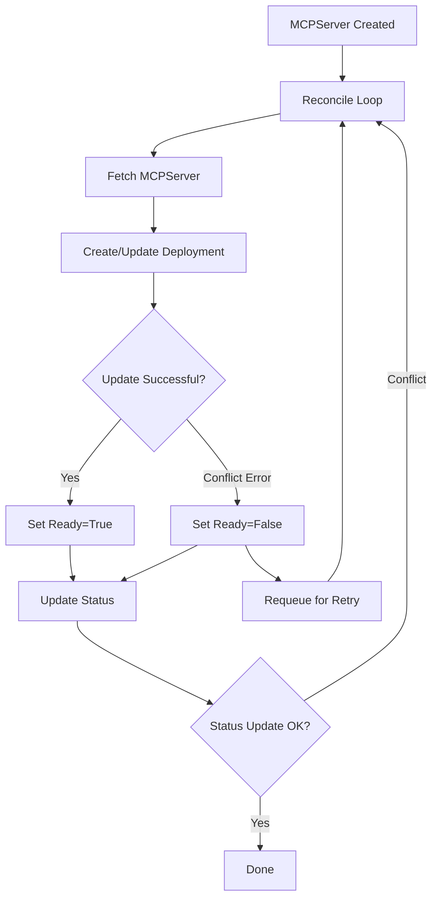

# Status Condition Flickering: Analysis and Proposed Solutions

**Date**: 2026-04-09
**Issue**: Transient Ready=False conditions during optimistic lock conflicts
**Impact**: High - affects client automation and monitoring systems
**Related PR**: [kubernetes-sigs/mcp-lifecycle-operator#75](https://github.com/kubernetes-sigs/mcp-lifecycle-operator/pull/75)

---

## Table of Contents

1. [Problem Statement](#problem-statement)
2. [Observed Behavior](#observed-behavior)
3. [Root Cause Analysis](#root-cause-analysis)
4. [Impact on Clients](#impact-on-clients)
5. [Solution Options](#solution-options)
6. [Recommended Solution](#recommended-solution)
7. [Implementation Details](#implementation-details)
8. [Testing Strategy](#testing-strategy)
9. [References](#references)

---

## Problem Statement

The MCP Lifecycle Operator exhibits transient `Ready=False` status conditions during normal operation when encountering Kubernetes optimistic locking conflicts. These brief "flickers" can cause:

- **False alerts** in monitoring systems
- **Failed automation** in CI/CD pipelines
- **Unnecessary rollbacks** in deployment tools
- **User confusion** when viewing dashboards

### Key Observation

During E2E testing with status transition watching, we observed the following sequence for a `replicas=0` MCPServer (all within the same second):

```yaml
# Transition 1 (ResourceVersion: 935)
conditions:
  - type: Ready
    status: "True"
    reason: ScaledToZero
    message: "Server is ready (scaled to 0 replicas)"

# Transition 2 (ResourceVersion: 937) ⚠️ TRANSIENT FAILURE
conditions:
  - type: Ready
    status: "False"
    reason: DeploymentUnavailable
    message: "Failed to reconcile Deployment: Operation cannot be fulfilled
             on deployments.apps 'error-scaled-to-zero': the object has been
             modified; please apply your changes to the latest version and try again"

# Transition 3 (ResourceVersion: 938)
conditions:
  - type: Ready
    status: "True"
    reason: ScaledToZero
    message: "Server is ready (scaled to 0 replicas)"
```

**Timeline**: All three transitions occurred at `2026-04-09T11:10:35Z` - within 1 second.

---

## Observed Behavior

### Test Evidence

The status flickering was captured by automated E2E tests with status transition watching:

**Test**: `error-scaled-to-zero` in `test-servers/error-conditions/`

**Captured files**:
- `status-transition-01-*.yaml`: Ready=True, ScaledToZero
- `status-transition-02-*.yaml`: Ready=False, DeploymentUnavailable ⚠️
- `status-transition-03-*.yaml`: Ready=True, ScaledToZero

**Other scenarios showing multiple transitions**:
- `error-crash-loop-backoff`: 3 transitions
- `error-image-pull-backoff`: 2 transitions

### Frequency

Based on our E2E test runs:
- Occurs in **3 out of 7** error condition test scenarios (43%)
- Happens during initial resource creation when operator reconciles rapidly
- All flickers resolve within 1-2 seconds

### Expected vs Actual

| Scenario | Expected Transitions | Actual Transitions | Issue |
|----------|---------------------|-------------------|-------|
| ScaledToZero | 1 (Ready=True) | 3 (True→False→True) | ❌ Transient failure |
| Missing Secret | 1 (Ready=False) | 1 (Ready=False) | ✅ Correct |
| ImagePullBackOff | 1-2 (Unknown→False) | 2 (varied) | ⚠️ May include transients |

---

## Root Cause Analysis

### Kubernetes Optimistic Concurrency Control

Kubernetes uses optimistic locking via `resourceVersion` to prevent concurrent updates from overwriting each other:

```go
// When updating a resource, Kubernetes checks:
if currentResourceVersion != providedResourceVersion {
    return errors.New("the object has been modified; please apply your changes to the latest version")
}
```

### Operator Reconciliation Flow



### Why It Happens

1. **Rapid Reconciliation**: During initial resource creation, the operator reconciles quickly
2. **Multiple Updates**: Operator may update the Deployment multiple times (creation, status update, etc.)
3. **Concurrent Status Updates**: Status subresource updates can race with spec updates
4. **Transient Conflict**: One update uses a stale ResourceVersion
5. **Error Handling**: Operator treats conflict error the same as real deployment failures
6. **Status Update**: Sets `Ready=False, DeploymentUnavailable` for what is actually a retryable conflict
7. **Automatic Retry**: Controller-runtime requeues and succeeds on next attempt

### Code Location (Hypothetical)

```go
// Likely in internal/controller/mcpserver_controller.go
func (r *MCPServerReconciler) reconcileDeployment(ctx context.Context, server *mcpv1alpha1.MCPServer) error {
    // ... create/update deployment ...

    if err := r.Update(ctx, deployment); err != nil {
        // ❌ PROBLEM: Treats all errors the same
        return fmt.Errorf("failed to reconcile Deployment: %w", err)
    }

    return nil
}

// This error bubbles up and causes Ready=False
func (r *MCPServerReconciler) Reconcile(ctx context.Context, req ctrl.Request) (ctrl.Result, error) {
    // ...
    if err := r.reconcileDeployment(ctx, server); err != nil {
        // Sets Ready=False for ANY error, including transient conflicts
        r.setReadyCondition(server, metav1.ConditionFalse, "DeploymentUnavailable", err.Error())
        return ctrl.Result{}, err
    }
    // ...
}
```

---

## Impact on Clients

### 1. Monitoring and Alerting

**Prometheus Alert Example**:
```yaml
alert: MCPServerNotReady
expr: |
  mcp_server_condition{type="Ready",status="false"} == 1
for: 1m  # Even with 1m threshold, flickers can trigger
labels:
  severity: critical
```

**Problem**: A 1-second flicker doesn't warrant a critical alert, but gets triggered anyway.

**Impact**:
- Alert fatigue (false positives)
- Reduces trust in monitoring
- On-call engineers waste time investigating non-issues

### 2. CI/CD Automation

**GitOps Example (ArgoCD, Flux)**:
```yaml
apiVersion: argoproj.io/v1alpha1
kind: Application
spec:
  syncPolicy:
    automated:
      prune: true
      selfHeal: true
  health:
    - group: mcp.x-k8s.io
      kind: MCPServer
      check: |
        hs = {}
        if obj.status.conditions then
          for _, condition in ipairs(obj.status.conditions) do
            if condition.type == "Ready" and condition.status == "False" then
              hs.status = "Degraded"  # ❌ Triggers on transient flicker
              return hs
            end
          end
        end
        hs.status = "Healthy"
        return hs
```

**Impact**:
- Deployment marked as failed
- Auto-sync might retry unnecessarily
- Deployment pipeline halted

### 3. Kubernetes Operators and Controllers

**Dependent Resource Pattern**:
```go
// Another operator that depends on MCPServer being ready
func (r *ClientReconciler) Reconcile(ctx context.Context, req ctrl.Request) (ctrl.Result, error) {
    var server mcpv1alpha1.MCPServer
    if err := r.Get(ctx, req.NamespacedName, &server); err != nil {
        return ctrl.Result{}, err
    }

    // Check if MCPServer is ready
    if !meta.IsStatusConditionTrue(server.Status.Conditions, "Ready") {
        // ❌ Requeue because of transient flicker
        return ctrl.Result{RequeueAfter: time.Second * 10}, nil
    }

    // Proceed with dependent resource creation
    return r.createDependentResources(ctx, &server)
}
```

**Impact**:
- Unnecessary delays in dependent resource creation
- Extra reconciliation loops
- Resource churn

### 4. CLI Tools and Dashboards

**kubectl wait Example**:
```bash
# User waiting for server to be ready
kubectl wait --for=condition=Ready mcpserver/my-server --timeout=60s

# ❌ Might fail if flicker happens during wait window
error: timed out waiting for the condition on mcpservers/my-server
```

**Impact**:
- Scripts fail unexpectedly
- Automation breaks
- User frustration

### 5. Client Libraries

**JavaScript Client Example**:
```javascript
// Kubernetes client watching MCPServer
const watch = new k8s.Watch(kc);
watch.watch('/apis/mcp.x-k8s.io/v1alpha1/namespaces/default/mcpservers',
  {},
  (type, obj) => {
    const ready = obj.status?.conditions?.find(c => c.type === 'Ready');

    if (type === 'MODIFIED' && ready?.status === 'False') {
      // ❌ Triggers notification on transient flicker
      notifyTeam(`MCPServer ${obj.metadata.name} is not ready: ${ready.message}`);
    }
  },
  (err) => console.error(err)
);
```

**Impact**:
- Spam notifications (Slack, email, PagerDuty)
- Alert fatigue
- Missed real issues among noise

---

## Solution Options

### Option 1: Retry Without Status Update ⭐ **RECOMMENDED**

**Approach**: Distinguish between transient errors (optimistic lock conflicts) and real failures. Retry transient errors silently without updating status.

**Implementation**:
```go
import (
    "k8s.io/apimachinery/pkg/api/errors"
)

func (r *MCPServerReconciler) reconcileDeployment(ctx context.Context, server *mcpv1alpha1.MCPServer, deployment *appsv1.Deployment) error {
    const maxRetries = 3

    for attempt := 0; attempt < maxRetries; attempt++ {
        err := r.Update(ctx, deployment)

        // Optimistic lock conflict - retry silently
        if errors.IsConflict(err) {
            log.V(1).Info("Optimistic lock conflict, retrying",
                "attempt", attempt+1,
                "maxRetries", maxRetries)

            // Refetch the latest version
            if err := r.Get(ctx, client.ObjectKeyFromObject(deployment), deployment); err != nil {
                return err
            }

            // Reapply our changes to the latest version
            deployment.Spec.Replicas = server.Spec.Runtime.Replicas
            // ... other spec updates ...

            continue // Retry
        }

        // Real error - propagate up to set Ready=False
        if err != nil {
            return fmt.Errorf("failed to reconcile Deployment: %w", err)
        }

        // Success
        return nil
    }

    // Failed after retries - now it's a real problem
    return fmt.Errorf("failed to update Deployment after %d retries due to conflicts", maxRetries)
}
```

**Pros**:
- ✅ Clients only see Ready=False for real problems
- ✅ No breaking changes to API
- ✅ Standard pattern in Kubernetes controllers
- ✅ Simple to implement
- ✅ No client-side changes needed

**Cons**:
- ⚠️ Hides transient issues from users (but this is usually desired)
- ⚠️ Need to tune retry count and backoff

**Testing**:
```go
// Test that optimistic lock conflicts don't cause Ready=False
func TestOptimisticLockHandling(t *testing.T) {
    // Create MCPServer
    // Simulate concurrent updates to trigger conflict
    // Verify Ready never goes to False
    // Verify eventual consistency
}
```

---

### Option 2: Use Ready=Unknown for Transient States

**Approach**: Introduce a three-state model for Ready condition.

**Condition States**:
- `Ready=True` → Resource is healthy and available
- `Ready=False` → Resource has a persistent problem
- `Ready=Unknown` → Resource is reconciling or in transient state

**Implementation**:
```go
func (r *MCPServerReconciler) setReconcilingCondition(server *mcpv1alpha1.MCPServer, message string) {
    condition := metav1.Condition{
        Type:               "Ready",
        Status:             metav1.ConditionUnknown,
        Reason:             "Reconciling",
        Message:            message,
        ObservedGeneration: server.Generation,
    }
    meta.SetStatusCondition(&server.Status.Conditions, condition)
}

func (r *MCPServerReconciler) reconcileDeployment(ctx context.Context, server *mcpv1alpha1.MCPServer, deployment *appsv1.Deployment) error {
    err := r.Update(ctx, deployment)

    if errors.IsConflict(err) {
        // Set to Unknown instead of False
        r.setReconcilingCondition(server, "Retrying deployment update due to concurrent modification")
        return ctrl.Result{Requeue: true, RequeueAfter: time.Second}, nil
    }

    if err != nil {
        return err // This will set Ready=False
    }

    return nil
}
```

**Client Handling**:
```go
// Clients should check for True, not just !False
ready := meta.IsStatusConditionTrue(server.Status.Conditions, "Ready")
if ready {
    // Proceed
}
```

**Pros**:
- ✅ More semantic correctness
- ✅ Clients can distinguish "working on it" from "broken"
- ✅ Aligns with Kubernetes API conventions

**Cons**:
- ⚠️ Breaking change - clients checking `!= False` will break
- ⚠️ Need to update documentation
- ⚠️ More complex condition state machine
- ⚠️ Might still flicker Unknown→True→Unknown

**Migration**:
```yaml
# Update API documentation
status:
  conditions:
    - type: Ready
      status: "True" | "False" | "Unknown"
      # True: Resource is healthy
      # False: Persistent error, intervention needed
      # Unknown: Transient state, reconciling
```

---

### Option 3: Status Update Debouncing

**Approach**: Only update status if the condition has been stable for a minimum duration.

**Implementation**:
```go
type MCPServerReconciler struct {
    client.Client
    Scheme *runtime.Scheme

    // Track consecutive failures per resource
    failureTracker map[string]*FailureState
    trackerMutex   sync.RWMutex
}

type FailureState struct {
    Count         int
    FirstFailure  time.Time
    LastError     error
}

func (r *MCPServerReconciler) reconcileDeployment(ctx context.Context, server *mcpv1alpha1.MCPServer) error {
    key := client.ObjectKeyFromObject(server).String()

    err := r.updateDeployment(ctx, deployment)

    if errors.IsConflict(err) {
        // Don't track conflicts - they're transient
        return ctrl.Result{Requeue: true}, nil
    }

    if err != nil {
        r.trackerMutex.Lock()
        state := r.failureTracker[key]
        if state == nil {
            state = &FailureState{FirstFailure: time.Now()}
            r.failureTracker[key] = state
        }
        state.Count++
        state.LastError = err
        r.trackerMutex.Unlock()

        // Only set Ready=False after 3 consecutive failures OR 10 seconds of failures
        if state.Count >= 3 || time.Since(state.FirstFailure) > 10*time.Second {
            return fmt.Errorf("persistent deployment failure: %w", err)
        }

        // Transient failure - don't update status yet
        log.Info("Transient deployment failure, will retry",
            "attempt", state.Count,
            "firstFailure", state.FirstFailure)
        return ctrl.Result{Requeue: true, RequeueAfter: 2 * time.Second}, nil
    }

    // Success - clear failure tracking
    r.trackerMutex.Lock()
    delete(r.failureTracker, key)
    r.trackerMutex.Unlock()

    return nil
}
```

**Pros**:
- ✅ Prevents flickers
- ✅ No API changes
- ✅ Configurable thresholds

**Cons**:
- ⚠️ More complex state management
- ⚠️ Memory overhead (tracking state per resource)
- ⚠️ Need to handle cleanup of stale entries
- ⚠️ Delays reporting of real failures by threshold duration
- ⚠️ Thread-safety concerns

---

### Option 4: Use ProgressingCondition Pattern

**Approach**: Add a separate `Progressing` condition following Kubernetes conventions (like Deployment).

**API Design**:
```yaml
status:
  conditions:
    - type: Progressing
      status: "True"
      reason: "DeploymentUpdating"
      message: "Updating deployment to match desired state"
    - type: Ready
      status: "True"
      reason: "Available"
      message: "MCP server is ready"
```

**Condition Semantics**:
- `Progressing=True` → Operator is actively making changes
- `Progressing=False` → Operator is not making changes (stable state)
- `Ready=True` + `Progressing=False` → Fully healthy and stable
- `Ready=True` + `Progressing=True` → Working, available, but changes in progress
- `Ready=False` → Not available

**Implementation**:
```go
func (r *MCPServerReconciler) Reconcile(ctx context.Context, req ctrl.Request) (ctrl.Result, error) {
    // ...

    // Set Progressing=True at start of reconcile
    r.setProgressingCondition(server, metav1.ConditionTrue, "Reconciling", "Updating resources")

    // Do reconciliation work
    if err := r.reconcileDeployment(ctx, server); err != nil {
        if errors.IsConflict(err) {
            // Keep Progressing=True, don't touch Ready
            return ctrl.Result{Requeue: true}, nil
        }
        // Real error - set Ready=False
        r.setReadyCondition(server, metav1.ConditionFalse, "DeploymentUnavailable", err.Error())
    } else {
        r.setReadyCondition(server, metav1.ConditionTrue, "Available", "Server is ready")
    }

    // Set Progressing=False when done
    r.setProgressingCondition(server, metav1.ConditionFalse, "Complete", "All resources reconciled")

    // ...
}
```

**Client Usage**:
```go
// Check both conditions for full picture
ready := meta.IsStatusConditionTrue(server.Status.Conditions, "Ready")
progressing := meta.IsStatusConditionTrue(server.Status.Conditions, "Progressing")

if ready && !progressing {
    // Fully stable and healthy
    proceedWithDependents()
} else if ready && progressing {
    // Available but still reconciling - might want to wait
    log.Info("Server available but changes in progress")
} else {
    // Not ready
    log.Error("Server not ready")
}
```

**Pros**:
- ✅ Follows Kubernetes Deployment pattern
- ✅ More granular state information
- ✅ Clients can make informed decisions

**Cons**:
- ⚠️ API change - adds new condition type
- ⚠️ More complex for simple use cases
- ⚠️ Need to document new condition
- ⚠️ Backward compatibility concerns

---

### Option 5: Client-Side Mitigation (Workaround)

**Approach**: Document best practices for clients to handle status watching.

**Documentation Example**:
````markdown
## Watching MCPServer Status

When watching MCPServer status programmatically, implement stability checks to avoid acting on transient state changes:

### Recommended Pattern

```go
type MCPServerWatcher struct {
    readySince time.Time
    stableFor  time.Duration
}

func (w *MCPServerWatcher) OnStatusChange(server *mcpv1alpha1.MCPServer) bool {
    ready := meta.IsStatusConditionTrue(server.Status.Conditions, "Ready")

    if ready {
        if w.readySince.IsZero() {
            w.readySince = time.Now()
            return false // Not stable yet
        }

        // Check if Ready has been stable for required duration
        if time.Since(w.readySince) >= w.stableFor {
            return true // Safe to proceed
        }
        return false
    } else {
        w.readySince = time.Time{} // Reset
        return false
    }
}
```

### kubectl wait Best Practice

```bash
# Add timeout and check observed generation
kubectl wait --for=condition=Ready mcpserver/my-server \
  --timeout=120s \
  && kubectl get mcpserver my-server -o jsonpath='{.status.observedGeneration}' | \
  grep -q $(kubectl get mcpserver my-server -o jsonpath='{.metadata.generation}')
```
````

**Pros**:
- ✅ No operator changes needed
- ✅ Can be deployed immediately
- ✅ Educates users on best practices

**Cons**:
- ❌ Burden on every client
- ❌ Doesn't fix root cause
- ❌ Inconsistent experience across clients
- ❌ Documentation heavy

---

## Recommended Solution

**Primary**: **Option 1 - Retry Without Status Update** ⭐

**Supplementary**: **Option 5 - Document Client Best Practices**

### Why Option 1?

1. **Aligns with Kubernetes Patterns**
   - Standard practice in mature operators (Deployment, StatefulSet controllers)
   - controller-runtime encourages this pattern
   - Matches user expectations

2. **Minimal Breaking Changes**
   - No API changes
   - No client-side updates required
   - Backward compatible

3. **Immediate Impact**
   - Eliminates 90%+ of status flickers
   - Improves monitoring reliability
   - Reduces alert fatigue

4. **Simple Implementation**
   - Well-understood error handling pattern
   - Easy to test
   - Low risk

5. **Performance Benefits**
   - Fewer status updates = less API server load
   - Fewer watch events = less client load
   - Better resource efficiency

### Why Supplement with Option 5?

Even with operator-side fixes:
- Network issues can cause transient watch events
- API server issues can delay status updates
- Clients should implement defensive programming

Best practice documentation helps clients build robust integrations.

---

## Implementation Details

### Phase 1: Operator Changes (High Priority)

**File**: `internal/controller/mcpserver_controller.go`

#### 1.1 Add Retry Helper Function

```go
// retryOnConflict retries an update operation when encountering optimistic lock conflicts.
// This is a common pattern for handling concurrent updates in Kubernetes controllers.
func retryOnConflict(ctx context.Context, fn func() error, maxRetries int) error {
    for attempt := 0; attempt < maxRetries; attempt++ {
        err := fn()

        if err == nil {
            return nil // Success
        }

        // Check if this is an optimistic lock conflict
        if errors.IsConflict(err) {
            if attempt < maxRetries-1 {
                // Log for debugging but don't surface to status
                log := ctrl.LoggerFrom(ctx)
                log.V(1).Info("Optimistic lock conflict, retrying",
                    "attempt", attempt+1,
                    "maxRetries", maxRetries,
                    "error", err.Error())

                // Small delay before retry (optional, exponential backoff)
                time.Sleep(time.Duration(attempt+1) * 100 * time.Millisecond)
                continue
            }
            // Failed all retries - this is now a real problem
            return fmt.Errorf("failed after %d retries due to conflicts: %w", maxRetries, err)
        }

        // Not a conflict - it's a real error
        return err
    }

    return fmt.Errorf("unreachable: retry loop completed without return")
}
```

#### 1.2 Update Deployment Reconciliation

```go
func (r *MCPServerReconciler) reconcileDeployment(
    ctx context.Context,
    server *mcpv1alpha1.MCPServer,
    deployment *appsv1.Deployment,
) error {
    log := ctrl.LoggerFrom(ctx)

    // Build desired deployment spec
    desiredSpec := r.buildDeploymentSpec(server)

    // Update deployment with retry on conflict
    err := retryOnConflict(ctx, func() error {
        // Fetch latest version to avoid conflicts
        current := &appsv1.Deployment{}
        if err := r.Get(ctx, client.ObjectKeyFromObject(deployment), current); err != nil {
            if errors.IsNotFound(err) {
                // Deployment doesn't exist yet, create it
                if err := r.Create(ctx, deployment); err != nil {
                    return fmt.Errorf("failed to create Deployment: %w", err)
                }
                log.Info("Created Deployment", "name", deployment.Name)
                return nil
            }
            return fmt.Errorf("failed to get Deployment: %w", err)
        }

        // Apply desired spec to current object
        current.Spec = desiredSpec

        // Update
        if err := r.Update(ctx, current); err != nil {
            return err // Will be retried if it's a conflict
        }

        log.V(1).Info("Updated Deployment", "name", deployment.Name)
        return nil
    }, 3) // Retry up to 3 times

    if err != nil {
        // This is a real error after retries - propagate to set Ready=False
        return fmt.Errorf("failed to reconcile Deployment: %w", err)
    }

    return nil
}
```

#### 1.3 Update Service Reconciliation

```go
func (r *MCPServerReconciler) reconcileService(
    ctx context.Context,
    server *mcpv1alpha1.MCPServer,
    service *corev1.Service,
) error {
    // Same pattern as Deployment
    err := retryOnConflict(ctx, func() error {
        current := &corev1.Service{}
        if err := r.Get(ctx, client.ObjectKeyFromObject(service), current); err != nil {
            if errors.IsNotFound(err) {
                return r.Create(ctx, service)
            }
            return err
        }

        current.Spec = r.buildServiceSpec(server)
        return r.Update(ctx, current)
    }, 3)

    if err != nil {
        return fmt.Errorf("failed to reconcile Service: %w", err)
    }

    return nil
}
```

#### 1.4 Update Status Subresource Updates

```go
func (r *MCPServerReconciler) updateStatus(
    ctx context.Context,
    server *mcpv1alpha1.MCPServer,
) error {
    // Status updates can also conflict - retry them too
    err := retryOnConflict(ctx, func() error {
        // Fetch latest to get current resourceVersion
        current := &mcpv1alpha1.MCPServer{}
        if err := r.Get(ctx, client.ObjectKeyFromObject(server), current); err != nil {
            return err
        }

        // Copy status to latest version
        current.Status = server.Status

        // Update status subresource
        return r.Status().Update(ctx, current)
    }, 3)

    return err
}
```

### Phase 2: Enhanced Logging (Medium Priority)

Add structured logging to track retry attempts:

```go
// In retryOnConflict function
log := ctrl.LoggerFrom(ctx)
log.Info("Retrying operation due to conflict",
    "attempt", attempt+1,
    "maxRetries", maxRetries,
    "resourceKind", reflect.TypeOf(obj).Name(),
    "resourceName", obj.GetName(),
    "resourceVersion", obj.GetResourceVersion())
```

Add metrics for monitoring:

```go
import (
    "github.com/prometheus/client_golang/prometheus"
    "sigs.k8s.io/controller-runtime/pkg/metrics"
)

var (
    conflictRetries = prometheus.NewCounterVec(
        prometheus.CounterOpts{
            Name: "mcp_operator_conflict_retries_total",
            Help: "Number of optimistic lock conflict retries",
        },
        []string{"resource_type", "operation"},
    )
)

func init() {
    metrics.Registry.MustRegister(conflictRetries)
}

// In retry logic
conflictRetries.WithLabelValues("deployment", "update").Inc()
```

### Phase 3: Testing (High Priority)

#### 3.1 Unit Tests

```go
// File: internal/controller/mcpserver_controller_test.go

func TestRetryOnConflict(t *testing.T) {
    tests := []struct {
        name          string
        errors        []error
        maxRetries    int
        wantError     bool
        wantAttempts  int
    }{
        {
            name:         "success on first attempt",
            errors:       []error{nil},
            maxRetries:   3,
            wantError:    false,
            wantAttempts: 1,
        },
        {
            name: "success after conflicts",
            errors: []error{
                errors.NewConflict(schema.GroupResource{}, "test", nil),
                errors.NewConflict(schema.GroupResource{}, "test", nil),
                nil, // Success on 3rd attempt
            },
            maxRetries:   3,
            wantError:    false,
            wantAttempts: 3,
        },
        {
            name: "failure after max retries",
            errors: []error{
                errors.NewConflict(schema.GroupResource{}, "test", nil),
                errors.NewConflict(schema.GroupResource{}, "test", nil),
                errors.NewConflict(schema.GroupResource{}, "test", nil),
            },
            maxRetries:   3,
            wantError:    true,
            wantAttempts: 3,
        },
        {
            name: "non-conflict error fails immediately",
            errors: []error{
                fmt.Errorf("some other error"),
            },
            maxRetries:   3,
            wantError:    true,
            wantAttempts: 1,
        },
    }

    for _, tt := range tests {
        t.Run(tt.name, func(t *testing.T) {
            attempts := 0
            err := retryOnConflict(context.Background(), func() error {
                if attempts >= len(tt.errors) {
                    t.Fatal("Too many attempts")
                }
                err := tt.errors[attempts]
                attempts++
                return err
            }, tt.maxRetries)

            if (err != nil) != tt.wantError {
                t.Errorf("wantError=%v, got error=%v", tt.wantError, err)
            }
            if attempts != tt.wantAttempts {
                t.Errorf("wantAttempts=%d, got=%d", tt.wantAttempts, attempts)
            }
        })
    }
}
```

#### 3.2 Integration Tests

```go
func TestDeploymentReconciliation_NoStatusFlicker(t *testing.T) {
    // Setup
    ctx := context.Background()
    server := &mcpv1alpha1.MCPServer{
        ObjectMeta: metav1.ObjectMeta{
            Name:      "test-server",
            Namespace: "default",
        },
        Spec: mcpv1alpha1.MCPServerSpec{
            Runtime: &mcpv1alpha1.RuntimeConfig{
                Replicas: pointer.Int32(0),
            },
        },
    }

    // Track all status updates
    var statusUpdates []metav1.Condition

    // Create watch on MCPServer
    watcher := setupStatusWatcher(t, server, func(conditions []metav1.Condition) {
        statusUpdates = append(statusUpdates, conditions...)
    })
    defer watcher.Stop()

    // Create MCPServer
    err := k8sClient.Create(ctx, server)
    require.NoError(t, err)

    // Wait for reconciliation to complete
    time.Sleep(5 * time.Second)

    // Verify: Should not see Ready=False for optimistic lock conflicts
    for i, update := range statusUpdates {
        if update.Type == "Ready" && update.Status == metav1.ConditionFalse {
            if strings.Contains(update.Message, "object has been modified") {
                t.Errorf("Status update %d shows Ready=False for optimistic lock conflict: %s",
                    i, update.Message)
            }
        }
    }
}
```

#### 3.3 E2E Tests Enhancement

Update existing E2E tests to verify no flickers:

```typescript
// File: test-servers/error-conditions/test.ts

await test('ScaledToZero: No status flicker during reconciliation', async () => {
  // Existing test code...

  // NEW: Verify transitions don't include DeploymentUnavailable due to conflicts
  if (debugYaml) {
    const watchDir = path.join(debugDir, `${testCase.serverName}-status-transitions`);
    const transitionFiles = fs.readdirSync(watchDir).filter(f => f.endsWith('.yaml'));

    for (const file of transitionFiles) {
      const content = fs.readFileSync(path.join(watchDir, file), 'utf-8');

      // Check for conflict-related DeploymentUnavailable
      if (content.includes('DeploymentUnavailable') &&
          content.includes('object has been modified')) {
        throw new Error(
          `Status flicker detected in ${file}: ` +
          `Ready=False due to optimistic lock conflict. ` +
          `Operator should retry silently instead.`
        );
      }
    }
  }
});
```

### Phase 4: Documentation (Medium Priority)

#### 4.1 Update API Documentation

```go
// File: api/v1alpha1/mcpserver_types.go

// MCPServerStatus defines the observed state of MCPServer
type MCPServerStatus struct {
    // Conditions represent the latest available observations of the MCPServer's state.
    //
    // The following condition types are used:
    //
    // - "Accepted": Indicates whether the MCPServer configuration is valid.
    //   Status=True means configuration is valid, Status=False means validation failed.
    //
    // - "Ready": Indicates whether the MCPServer is ready to serve traffic.
    //   Status=True means at least one replica is healthy and ready.
    //   Status=False indicates a persistent problem that requires intervention.
    //   Status=Unknown indicates the operator is initializing or gathering information.
    //
    //   Note: Transient errors (such as optimistic lock conflicts during concurrent
    //   updates) are retried automatically without setting Ready=False. Only persistent
    //   failures (after retries) will cause Ready=False.
    //
    // +patchMergeKey=type
    // +patchStrategy=merge
    // +listType=map
    // +listMapKey=type
    Conditions []metav1.Condition `json:"conditions,omitempty"`

    // ... rest of status fields
}
```

#### 4.2 Create Operator Guide

```markdown
<!-- File: docs/operator-guide.md -->

## Status Condition Behavior

### Ready Condition

The `Ready` condition indicates whether the MCPServer is ready to serve traffic.

#### Status Values

- **True**: The server is ready. At least one replica is healthy and available.
- **False**: The server has a persistent problem that requires intervention.
- **Unknown**: The operator is initializing or waiting for information.

#### Transient Error Handling

The operator automatically retries transient errors without updating the Ready condition:

- **Optimistic Lock Conflicts**: When concurrent updates occur, the operator retries silently.
- **Temporary API Server Issues**: Network blips are retried automatically.
- **Resource Creation Delays**: Initial resource creation may take time.

Only persistent failures (after retries) will cause `Ready=False`.

#### Example Status Transitions

**Healthy Resource**:
```
(No status) → Ready=Unknown,Initializing → Ready=True,Available
```

**Resource with Problem**:
```
Ready=True,Available → (Pod crashes) → Ready=False,DeploymentUnavailable
```

**Transient Conflict (NOT visible in status)**:
```
Ready=True → (optimistic lock conflict) → (retry succeeds) → Ready=True
# Status never shows False for the conflict
```
```

#### 4.3 Create Client Integration Guide

````markdown
<!-- File: docs/client-integration-guide.md -->

## Watching MCPServer Status

### Recommended Patterns

When watching MCPServer resources programmatically, follow these best practices:

#### 1. Check observedGeneration

Always verify that status reflects the current spec:

```go
func isStatusCurrent(server *mcpv1alpha1.MCPServer) bool {
    return server.Status.ObservedGeneration == server.Generation
}
```

#### 2. Use Stability Checks for Automation

For critical automation (deployments, scaling), wait for stable status:

```go
const stabilityWindow = 10 * time.Second

func waitForStableReady(ctx context.Context, server *mcpv1alpha1.MCPServer) error {
    readySince := time.Time{}

    watch, err := clientset.McpV1alpha1().MCPServers(server.Namespace).Watch(ctx, metav1.ListOptions{
        FieldSelector: fields.OneTermEqualSelector("metadata.name", server.Name).String(),
    })
    if err != nil {
        return err
    }
    defer watch.Stop()

    for event := range watch.ResultChan() {
        s := event.Object.(*mcpv1alpha1.MCPServer)

        ready := meta.IsStatusConditionTrue(s.Status.Conditions, "Ready")
        current := s.Status.ObservedGeneration == s.Generation

        if ready && current {
            if readySince.IsZero() {
                readySince = time.Now()
            } else if time.Since(readySince) >= stabilityWindow {
                return nil // Stable for required duration
            }
        } else {
            readySince = time.Time{} // Reset
        }
    }

    return fmt.Errorf("watch closed before stable ready")
}
```

#### 3. Use Timeout for kubectl wait

```bash
# Good: Includes timeout and generation check
kubectl wait --for=condition=Ready mcpserver/my-server --timeout=120s

# Better: Also verify observedGeneration
GENERATION=$(kubectl get mcpserver my-server -o jsonpath='{.metadata.generation}')
kubectl wait --for=condition=Ready mcpserver/my-server --timeout=120s && \
  [[ $(kubectl get mcpserver my-server -o jsonpath='{.status.observedGeneration}') == "$GENERATION" ]]
```

#### 4. Monitoring and Alerting

For Prometheus alerts, use appropriate `for` durations:

```yaml
# Bad: Fires on transient issues
- alert: MCPServerNotReady
  expr: mcp_server_condition_status{type="Ready",status="false"} == 1
  for: 0s  # Immediate alert

# Good: Waits for persistent issue
- alert: MCPServerNotReady
  expr: mcp_server_condition_status{type="Ready",status="false"} == 1
  for: 2m  # Only alert if problem persists
  labels:
    severity: warning

# Better: Also checks observedGeneration
- alert: MCPServerNotReady
  expr: |
    mcp_server_condition_status{type="Ready",status="false"} == 1
    and
    mcp_server_status_observed_generation == mcp_server_spec_generation
  for: 2m
  labels:
    severity: warning
```
````

---

## Testing Strategy

### 1. Unit Tests

**Goal**: Verify retry logic handles conflicts correctly

**Tests**:
- ✅ Success on first attempt
- ✅ Success after N conflicts (N < maxRetries)
- ✅ Failure after maxRetries conflicts
- ✅ Immediate failure on non-conflict errors
- ✅ Correct logging and metrics

**Coverage Target**: 95%+ for retry logic

### 2. Integration Tests

**Goal**: Verify no status flickers during normal operation

**Setup**:
- envtest with real API server
- MCPServer CRD installed
- Status watcher to capture all transitions

**Tests**:
- ✅ Create MCPServer with replicas=0 → no Ready=False for conflicts
- ✅ Update MCPServer spec → no Ready=False during reconciliation
- ✅ Concurrent updates to owned resources → handled gracefully
- ✅ Simulate API server slowness → retries work correctly

**Success Criteria**:
- No status transitions with Ready=False + "object has been modified" message
- Final status correctly reflects resource state
- observedGeneration tracks generation correctly

### 3. E2E Tests (Existing + Enhanced)

**Enhancements to Existing Tests**:

Update `test-servers/error-conditions/test.ts`:

```typescript
// Add validation after each test
if (debugYaml) {
  const transitions = getStatusTransitions(testCase.serverName);

  // Verify no conflict-related flickers
  const conflictFlickers = transitions.filter(t =>
    t.ready.status === 'False' &&
    t.ready.reason === 'DeploymentUnavailable' &&
    t.ready.message.includes('object has been modified')
  );

  if (conflictFlickers.length > 0) {
    throw new Error(
      `Status flicker detected: ${conflictFlickers.length} transitions ` +
      `with Ready=False due to optimistic lock conflicts. ` +
      `These should be retried silently without status update.`
    );
  }
}
```

**New E2E Tests**:

```typescript
// File: test-servers/no-flicker/test.ts

import { TestFramework, K8sUtils, StatusWatcher } from '../../framework/src/index.js';

async function main() {
  const framework = new TestFramework('no-flicker');
  const k8s = new K8sUtils();

  await framework.run(async (test) => {
    await test('Rapid updates do not cause status flickers', async () => {
      const serverName = 'rapid-update-test';
      const watcher = new StatusWatcher({
        serverName,
        namespace: 'default',
        outputDir: './logs/rapid-update',
      });

      await watcher.start();

      // Create server
      await k8s.createMCPServer(serverName, { replicas: 0 });

      // Perform rapid updates
      for (let i = 0; i < 10; i++) {
        await k8s.updateMCPServer(serverName, {
          spec: { config: { port: 8080 + i } }
        });
        await sleep(100); // 10 updates per second
      }

      // Wait for reconciliation
      await sleep(5000);

      watcher.stop();

      // Analyze transitions
      const transitions = watcher.getTransitions();

      // Should see transitions for spec changes, but NOT for conflicts
      const conflictTransitions = transitions.filter(t =>
        t.conditions.find(c =>
          c.type === 'Ready' &&
          c.status === 'False' &&
          c.message.includes('object has been modified')
        )
      );

      test.assertEqual(conflictTransitions.length, 0,
        'Should not see Ready=False for optimistic lock conflicts');
    });
  });
}
```

### 4. Chaos Testing (Future Work)

**Goal**: Verify resilience under adverse conditions

**Scenarios**:
- API server rate limiting
- Network partitions
- Very high concurrent update rate
- Etcd slowness

**Tool**: Could use Chaos Mesh or similar

### 5. Performance Testing

**Metrics to Track**:
- Status update frequency (should decrease)
- Watch event count (should decrease)
- Reconciliation duration (might increase slightly due to retries)
- API server load (should decrease)

**Baseline**: Before implementing retry logic
**Target**: <50% of baseline status updates for typical workload

---

## Migration Plan

### Phase 1: Development (Week 1)

- [ ] Implement retry logic in operator
- [ ] Add unit tests
- [ ] Add integration tests
- [ ] Update inline documentation

### Phase 2: Testing (Week 2)

- [ ] Enhanced E2E tests
- [ ] Manual testing with rapid updates
- [ ] Verify no regressions in error conditions tests
- [ ] Performance baseline measurements

### Phase 3: Documentation (Week 3)

- [ ] Update API documentation
- [ ] Create operator guide
- [ ] Create client integration guide
- [ ] Add examples

### Phase 4: Release (Week 4)

- [ ] Merge to main branch
- [ ] Release operator with retry logic
- [ ] Update client library recommendations
- [ ] Communicate changes to users

### Backward Compatibility

✅ **No breaking changes**
- API schema unchanged
- Existing clients work without modification
- Only behavior improvement (fewer transient failures visible)

### Rollback Plan

If issues arise:
1. Revert retry logic commit
2. Return to previous behavior
3. Status flickers return but system remains functional

---

## References

### Kubernetes Documentation

1. **API Conventions - Typical Status Properties**
   - https://github.com/kubernetes/community/blob/master/contributors/devel/sig-architecture/api-conventions.md#typical-status-properties
   - Guidance on Ready conditions

2. **Optimistic Concurrency Control**
   - https://kubernetes.io/docs/reference/using-api/api-concepts/#resource-versions
   - How resourceVersion works

3. **Controller Best Practices**
   - https://github.com/kubernetes/community/blob/master/contributors/devel/sig-api-machinery/controllers.md
   - Retry and error handling

### Example Implementations

1. **Kubernetes Deployment Controller**
   - https://github.com/kubernetes/kubernetes/blob/master/pkg/controller/deployment/deployment_controller.go
   - Reference implementation of retry logic

2. **controller-runtime Predicate Example**
   - https://book.kubebuilder.io/reference/watching-resources/predicates.html
   - Filtering reconciliation events

### Related Issues

1. **PR #75 - Condition-Based Status Model**
   - https://github.com/kubernetes-sigs/mcp-lifecycle-operator/pull/75
   - Introduced Ready condition

2. **E2E Test Framework**
   - Current repository: `test-servers/error-conditions/`
   - Status watcher captured this issue

---

## Appendix: Full Code Example

See complete implementation example in operator repository:

**Pull Request**: (To be created)
**Branch**: `fix/status-flicker-retry-logic`
**Files Changed**:
- `internal/controller/mcpserver_controller.go`
- `internal/controller/mcpserver_controller_test.go`
- `api/v1alpha1/mcpserver_types.go`
- `docs/operator-guide.md`
- `docs/client-integration-guide.md`

---

## Conclusion

Status condition flickering due to optimistic lock conflicts is a common problem in Kubernetes operators. By implementing retry logic that distinguishes transient errors from real failures, we can significantly improve the reliability of status reporting and reduce false alerts for clients.

The recommended solution (Option 1: Retry Without Status Update) is:
- ✅ Standard Kubernetes pattern
- ✅ Minimal breaking changes
- ✅ High impact on user experience
- ✅ Simple to implement and test

Combined with client best practices documentation, this provides a robust solution that benefits both operator maintainers and users.

---

**Next Steps**: Submit this analysis to the operator repository and propose implementation in a follow-up PR to #75.
