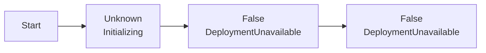

# E2E Test Suite: Analysis, Issues, and Suggestions

**Generated**: 2026-04-09
**Current Status**: 68 tests passing, status transition validation framework complete

---

## Table of Contents

1. [Current Issues](#current-issues)
2. [Missing Test Coverage](#missing-test-coverage)
3. [Test Framework Improvements](#test-framework-improvements)
4. [Performance Optimizations](#performance-optimizations)
5. [Documentation Gaps](#documentation-gaps)
6. [Operational Improvements](#operational-improvements)
7. [Advanced Testing Scenarios](#advanced-testing-scenarios)
8. [Priority Recommendations](#priority-recommendations)

---

## Current Issues

### 🔴 High Priority

#### 1. ImagePullBackOff Validation Rule Needs Updating

**Issue**: The validation expects `DeploymentUnavailable` immediately, but actually gets `Initializing` first.

**Current validation**:
```typescript
transitionValidation: {
  expectedTransitions: [{
    conditionType: 'Ready',
    status: 'False',
    reason: 'DeploymentUnavailable',
  }],
}
```

**Actual sequence**:
1. Ready=Unknown, reason=Initializing
2. Ready=False, reason=DeploymentUnavailable
3. (Multiple updates as pods fail)

**Fix**:
```typescript
transitionValidation: {
  expectedTransitions: [
    {
      conditionType: 'Ready',
      status: 'Unknown',
      reason: 'Initializing',
      messageContains: 'Waiting for Deployment',
    },
    {
      conditionType: 'Ready',
      status: 'False',
      reason: 'DeploymentUnavailable',
      messageNotContains: 'object has been modified',
    },
  ],
  ...TransitionValidator.noOptimisticLockFlickers(),
  allowExtraTransitions: true, // Pod retries cause multiple updates
}
```

**File**: `test-servers/error-conditions/test.ts`, line ~78-95

---

#### 2. Intermittent Optimistic Lock Flicker Not Caught

**Issue**: The ScaledToZero flicker is intermittent (race condition). This run showed 1 transition, previous run showed 3.

**Evidence**:
- Run 1 (2026-04-09T11-10-35): 3 transitions (flicker detected)
- Run 2 (2026-04-09T12-48-18): 1 transition (no flicker)

**Problem**: Tests are non-deterministic. Sometimes pass, sometimes fail.

**Potential Solutions**:

**Option A: Run Multiple Times**
```typescript
// In test case configuration
{
  name: 'ScaledToZero',
  // ... config ...
  repeatCount: 5, // Run 5 times to catch intermittent issues
  failIfAnyAttemptFails: true,
}
```

**Option B: Stress Test**
```bash
# Run test 10 times and check if flicker appears
for i in {1..10}; do
  DEBUG_YAML=1 ./scripts/test-server.sh test-servers/error-conditions
done
```

**Option C: Mark as Expected Flake**
```typescript
transitionValidation: {
  // ...
  allowIntermittentFlicker: true, // Document known issue
  expectFlickerRate: 0.3, // Expect flicker in ~30% of runs
}
```

**Recommendation**: Option A (repeat test) until operator is fixed.

---

#### 3. No Validation on operator-features Tests

**Issue**: The comprehensive operator-features test has no transition validation despite being a critical test.

**Current**: Only validates final status (Accepted=True, Ready=True)

**Suggested addition**:
```typescript
// In test-servers/operator-features/test.ts
if (debugYaml) {
  const watchDir = path.join(debugDir, 'status-transitions');

  const validationResult = TransitionValidator.validate({
    name: 'Operator features should have clean transitions',
    expectedTransitions: [
      // May have Initializing first
      {
        conditionType: 'Ready',
        status: 'True',
        reason: 'Available',
      },
    ],
    ...TransitionValidator.noOptimisticLockFlickers(),
    allowExtraTransitions: true,
  }, watchDir);

  test.assert(validationResult.passed,
    `Transition validation failed: ${validationResult.errors.join('\n')}`);
}
```

---

### 🟡 Medium Priority

#### 4. CrashLoopBackOff Validation Missing

**Issue**: Test case exists but has no `transitionValidation` defined.

**Expected behavior**: Similar to ImagePullBackOff (Initializing → DeploymentUnavailable)

**Add validation**:
```typescript
{
  name: 'CrashLoopBackOff',
  // ... existing config ...
  transitionValidation: {
    name: 'CrashLoop should show DeploymentUnavailable',
    expectedTransitions: [
      {
        conditionType: 'Ready',
        status: 'False',
        reason: 'DeploymentUnavailable',
        messageNotContains: 'object has been modified',
      },
    ],
    ...TransitionValidator.noOptimisticLockFlickers(),
    allowExtraTransitions: true, // Multiple crash attempts
  },
}
```

---

#### 5. Transition Timing Not Tracked

**Issue**: We capture transitions but don't analyze timing.

**Use cases**:
- How long does Initializing last?
- How fast does configuration validation happen?
- Performance regression detection

**Suggested enhancement**:
```typescript
// In TransitionValidator
export interface TransitionTiming {
  totalDuration: number; // ms from first to last transition
  transitionDeltas: number[]; // ms between each transition
  averageTransitionTime: number;
}

static analyzeTimings(transitions: ActualTransition[]): TransitionTiming {
  // Parse timestamps and calculate deltas
  // ...
}
```

**Usage**:
```typescript
const timing = TransitionValidator.analyzeTimings(validationResult.actualTransitions);
console.log(`Total reconciliation time: ${timing.totalDuration}ms`);

// Assert performance
test.assert(timing.totalDuration < 5000,
  'Reconciliation should complete within 5 seconds');
```

---

#### 6. ResourceVersion Gaps Not Validated

**Issue**: We see ResourceVersion increments (935 → 937 → 938) but don't validate they're sequential.

**Observation**: The gap (935 → 937) suggests an update we didn't capture.

**Potential causes**:
- Status update happened before watcher started
- Multiple fields updated in quick succession
- Operator updated something else (Service, Deployment)

**Suggested validation**:
```typescript
// Warn if ResourceVersion gaps exist
for (let i = 1; i < transitions.length; i++) {
  const prev = parseInt(transitions[i-1].resourceVersion);
  const curr = parseInt(transitions[i].resourceVersion);
  const gap = curr - prev;

  if (gap > 1) {
    warnings.push(
      `⚠️  ResourceVersion gap detected: ${prev} → ${curr} (gap of ${gap-1}). ` +
      `May have missed ${gap-1} update(s)`
    );
  }
}
```

---

### 🟢 Low Priority

#### 7. Bash Watcher vs TypeScript Watcher Inconsistency

**Issue**:
- `error-conditions` uses TypeScript `StatusWatcher`
- `operator-features` uses bash `watch-status.sh`

**Inconsistency**: Different implementations may capture differently.

**Recommendation**: Standardize on TypeScript watcher for all tests.

**Migration**:
```typescript
// In test-servers/operator-features/test.ts
import { StatusWatcher } from '../../framework/src/index.js';

const watcher = new StatusWatcher({
  serverName: 'operator-features',
  namespace: 'default',
  outputDir: path.join(debugDir, 'status-transitions'),
});

await watcher.start();
// ... deploy and test ...
watcher.stop();
```

---

#### 8. No Test for Deleted Resources

**Issue**: We test creation but not deletion behavior.

**Missing**: Status transitions during deletion (finalizers, cleanup).

**Suggested test**:
```typescript
await test('Resource deletion cleans up properly', async () => {
  // Deploy resource
  // Capture status
  // Delete resource
  // Verify finalizers run
  // Verify dependent resources cleaned up
  // Verify status during deletion
});
```

---

## Missing Test Coverage

### 🎯 Condition-Related

#### 1. Initializing State Not Explicitly Tested

**Status**: Captured in ImagePullBackOff, but not purpose-built test.

**Suggested test**:
```yaml
# manifests/08-slow-initialization.yaml
apiVersion: mcp.x-k8s.io/v1alpha1
kind: MCPServer
metadata:
  name: error-slow-init
spec:
  source:
    type: ContainerImage
    containerImage:
      ref: ghcr.io/modelcontextprotocol/servers/everything:latest
  runtime:
    readinessProbe:
      httpGet:
        path: /ready
      initialDelaySeconds: 30  # Force long initialization
```

**Expected transitions**:
1. Ready=Unknown, Initializing (30+ seconds)
2. Ready=True, Available

---

#### 2. No Test for Condition Ordering

**Issue**: Kubernetes API conventions recommend condition ordering, but we don't validate.

**Expected order** (from Kubernetes conventions):
1. Most specific conditions first
2. `Ready` condition last

**Validation**:
```typescript
test.assert(
  conditions[conditions.length - 1].type === 'Ready',
  'Ready condition should be last'
);
```

---

#### 3. observedGeneration Updates Not Tested

**Issue**: We check `observedGeneration` is set, but not that it updates correctly.

**Missing test**: What happens when spec changes while reconciling?

**Suggested test**:
```typescript
await test('observedGeneration updates on spec change', async () => {
  // Create server, wait for Ready=True, generation=1, observedGeneration=1
  // Update spec (change replicas)
  // Verify generation=2
  // Watch transitions - should see observedGeneration=1 initially
  // Then observedGeneration=2 after reconciliation
});
```

---

#### 4. lastTransitionTime Not Validated

**Issue**: We capture it but don't verify it changes appropriately.

**Validation needed**:
- Should NOT change if status/reason don't change
- SHOULD change if status or reason changes

**Implementation**:
```typescript
// In TransitionValidator
for (let i = 1; i < transitions.length; i++) {
  const prev = transitions[i-1].conditions.find(c => c.type === 'Ready');
  const curr = transitions[i].conditions.find(c => c.type === 'Ready');

  const statusChanged = prev.status !== curr.status || prev.reason !== curr.reason;
  const timeChanged = prev.lastTransitionTime !== curr.lastTransitionTime;

  if (statusChanged && !timeChanged) {
    errors.push('lastTransitionTime should change when status/reason changes');
  }

  if (!statusChanged && timeChanged) {
    warnings.push('lastTransitionTime changed without status/reason change');
  }
}
```

---

### 🔄 Operational Scenarios

#### 5. No Update Tests (Only Creation)

**Missing**: Tests that update existing resources.

**Scenarios to test**:
- Change `spec.runtime.replicas`
- Change `spec.config.port`
- Change `spec.source.containerImage.ref`
- Change `spec.config.storage` (add/remove volumes)

**Suggested test**:
```typescript
await test('Updating replicas triggers re-reconciliation', async () => {
  // Create with replicas=1
  // Wait for Ready=True
  // Update to replicas=2
  // Verify observedGeneration increments
  // Verify Ready stays True (no flicker)
  // Verify deployment updates
});
```

---

#### 6. No Concurrent Operation Tests

**Missing**: What happens with concurrent updates?

**Scenarios**:
- User updates spec while operator reconciling
- Multiple users update same resource
- Operator restarted during reconciliation

**Implementation**: Could use `kubectl patch` in tight loop while operator reconciles.

---

#### 7. No Resource Ownership Tests

**Missing**: Verify operator properly owns created resources.

**Should test**:
- Deployment has `ownerReferences` pointing to MCPServer
- Service has `ownerReferences`
- Deletion cascades properly

**Validation**:
```typescript
const deployment = await k8s.getDeployment(deploymentName);
test.assert(
  deployment.metadata.ownerReferences?.some(
    ref => ref.kind === 'MCPServer' && ref.name === serverName
  ),
  'Deployment should have MCPServer as owner'
);
```

---

#### 8. No Operator Restart Tests

**Missing**: What happens if operator crashes/restarts?

**Scenarios**:
- Operator restarts mid-reconciliation
- Operator restarts with pending changes
- Operator version upgrade

---

### 📊 Status Field Coverage

#### 9. address.url Format Not Validated

**Current**: We check it exists, not format.

**Should validate**:
```typescript
const url = status.address.url;
test.assert(url.startsWith('http://'), 'URL should use http protocol');
test.assert(url.includes(serverName), 'URL should contain server name');
test.assert(url.includes(namespace), 'URL should contain namespace');
test.assert(url.endsWith(`:${port}${path}`), 'URL should have correct port and path');
```

---

#### 10. No Test for Status Subresource Separation

**Missing**: Verify status updates don't modify spec.

**Test**: Try to update spec via status subresource (should fail).

---

## Test Framework Improvements

### 🛠️ Validation Enhancements

#### 1. Add Pre-Built Validation Rules

**Current**: Only `noOptimisticLockFlickers()` exists.

**Suggested additions**:
```typescript
// In TransitionValidator

// Validates single-transition scenarios (immediate errors)
static singleTransition(condition: ExpectedTransition): Partial<TransitionValidationRule> {
  return {
    expectedTransitions: [condition],
    allowExtraTransitions: false,
    strictCount: true,
  };
}

// Validates happy path (Initializing → Available)
static happyPath(): Partial<TransitionValidationRule> {
  return {
    expectedTransitions: [
      { conditionType: 'Ready', status: 'Unknown', reason: 'Initializing' },
      { conditionType: 'Ready', status: 'True', reason: 'Available' },
    ],
    ...TransitionValidator.noOptimisticLockFlickers(),
  };
}

// Validates error path (Initializing → DeploymentUnavailable)
static deploymentFailure(messageContains?: string): Partial<TransitionValidationRule> {
  return {
    expectedTransitions: [
      { conditionType: 'Ready', status: 'False', reason: 'DeploymentUnavailable', messageContains },
    ],
    ...TransitionValidator.noOptimisticLockFlickers(),
    allowExtraTransitions: true,
  };
}
```

**Usage**:
```typescript
transitionValidation: {
  name: 'Happy path deployment',
  ...TransitionValidator.happyPath(),
}
```

---

#### 2. Add Transition Graph Visualization

**Enhancement**: Generate visual graph of transitions.

**Implementation**:
```typescript
static generateMermaidDiagram(transitions: ActualTransition[]): string {
  let diagram = 'graph LR\n';

  for (let i = 0; i < transitions.length; i++) {
    const condition = transitions[i].conditions.find(c => c.type === 'Ready');
    const node = `T${i}["${condition.status}\\n${condition.reason}"]`;

    if (i > 0) {
      diagram += `  T${i-1} --> ${node}\n`;
    } else {
      diagram += `  Start --> ${node}\n`;
    }
  }

  return diagram;
}
```

**Output**:


---

#### 3. Add Message Pattern Library

**Enhancement**: Common message patterns for better validation.

**Implementation**:
```typescript
export const MessagePatterns = {
  // Optimistic lock conflicts
  CONFLICT: /object has been modified|Operation cannot be fulfilled/,

  // Configuration errors
  SECRET_NOT_FOUND: /Secret .* not found/,
  CONFIGMAP_NOT_FOUND: /ConfigMap .* not found/,

  // Deployment issues
  IMAGE_PULL: /ImagePullBackOff|ErrImagePull/,
  CRASH_LOOP: /CrashLoopBackOff/,

  // Success
  AVAILABLE: /ready|available/i,
  SCALED_TO_ZERO: /scaled to 0/,
};
```

**Usage**:
```typescript
{
  conditionType: 'Ready',
  status: 'False',
  reason: 'ConfigurationInvalid',
  messageMatches: MessagePatterns.SECRET_NOT_FOUND,
}
```

---

### 🔍 Analysis Tools

#### 4. Add Transition Comparison Tool

**Use case**: Compare transitions between test runs.

**Implementation**:
```bash
# scripts/compare-transitions.sh
BASELINE_DIR="$1"
CURRENT_DIR="$2"

diff -u \
  <(find "$BASELINE_DIR" -name "*.yaml" | xargs grep "reason:" | sort) \
  <(find "$CURRENT_DIR" -name "*.yaml" | xargs grep "reason:" | sort)
```

**Usage**:
```bash
# Save baseline
mv logs/debug-yaml/error-conditions-latest logs/baseline

# Run tests again
DEBUG_YAML=1 ./scripts/run-e2e.sh

# Compare
./scripts/compare-transitions.sh logs/baseline logs/debug-yaml/error-conditions-*
```

---

#### 5. Add Metrics Collection

**Enhancement**: Track test metrics over time.

**Metrics to collect**:
- Transition count per scenario
- Reconciliation timing
- Flicker detection rate
- Test duration

**Implementation**:
```typescript
// In test runner
const metrics = {
  runId: Date.now(),
  scenarios: testCases.map(tc => ({
    name: tc.name,
    transitionCount: getTransitionCount(tc.serverName),
    totalDuration: getTestDuration(tc.serverName),
    flickerDetected: hasFlicker(tc.serverName),
  })),
};

fs.writeFileSync('logs/metrics.jsonl', JSON.stringify(metrics) + '\n', { flag: 'a' });
```

**Analysis**:
```bash
# Show flicker rate over last 10 runs
jq -s 'map(.scenarios[] | select(.name == "ScaledToZero") | .flickerDetected) |
       add / length' logs/metrics.jsonl
```

---

## Performance Optimizations

### ⚡ Speed Improvements

#### 1. Test Duration Too Long (260+ seconds)

**Current**: Full test suite takes 4+ minutes.

**Breakdown** (estimated):
- Cluster setup: ~60s
- Operator build/deploy: ~80s
- error-conditions: ~120s (7 scenarios × various wait times)
- kubernetes-mcp-server: ~30s
- operator-features: ~30s
- Cleanup: ~10s

**Optimization opportunities**:

**A. Parallel Test Execution**
```typescript
// Run independent scenarios in parallel
const scenarioPromises = testCases.map(async (testCase) => {
  // Each scenario creates its own namespace
  const namespace = `test-${testCase.serverName}`;
  await k8s.createNamespace(namespace);
  // ... run test in isolated namespace ...
});

await Promise.all(scenarioPromises);
```

**Estimated savings**: 50-70s (scenarios run concurrently instead of serially)

---

**B. Reduce Stabilization Times**
```typescript
// Current
stabilizationTime: 60, // ImagePullBackOff

// Optimized - poll for condition instead of fixed wait
async function waitForCondition(predicate, timeout = 60000) {
  const start = Date.now();
  while (Date.now() - start < timeout) {
    if (await predicate()) return;
    await sleep(1000);
  }
  throw new Error('Timeout waiting for condition');
}

await waitForCondition(async () => {
  const condition = await k8s.getMCPServerCondition(name, 'Ready');
  return condition.reason === 'DeploymentUnavailable';
}, 60000);
```

**Estimated savings**: 20-30s (exit early when condition met)

---

**C. Cache Operator Build**
```bash
# In scripts/deploy-operator.sh

if [ -f ".operator-cache/${OPERATOR_REF}.tar" ]; then
  echo "Loading cached operator image..."
  docker load -i ".operator-cache/${OPERATOR_REF}.tar"
else
  echo "Building operator..."
  docker build -t mcp-operator:test .
  mkdir -p .operator-cache
  docker save mcp-operator:test -o ".operator-cache/${OPERATOR_REF}.tar"
fi
```

**Estimated savings**: 40-50s on subsequent runs

---

**D. Reuse Kind Cluster**
```bash
# Add option to skip cluster creation
REUSE_CLUSTER=${REUSE_CLUSTER:-false}

if [ "$REUSE_CLUSTER" = "true" ] && kind get clusters | grep -q "^kind$"; then
  echo "Reusing existing cluster..."
else
  echo "Creating new cluster..."
  kind create cluster
fi
```

**Estimated savings**: 50-60s on subsequent runs

**Usage**:
```bash
# First run - full setup
./scripts/run-e2e.sh

# Subsequent runs - reuse cluster
REUSE_CLUSTER=true ./scripts/run-e2e.sh
```

---

**Total potential savings**: 160-210s → **Target: <90s for full suite**

---

### 💾 Resource Usage

#### 2. Docker Image Cache Not Utilized

**Issue**: Each test run rebuilds operator-features-validator image.

**Fix**: Tag with content hash
```bash
# In scripts/build-images.sh
CONTENT_HASH=$(find test-servers/operator-features/validator -type f -exec sha256sum {} \; | sha256sum | cut -d' ' -f1 | cut -c1-12)
IMAGE_TAG="localhost/operator-features-validator:${CONTENT_HASH}"

if docker images -q "$IMAGE_TAG" >/dev/null 2>&1; then
  echo "Using cached image $IMAGE_TAG"
else
  docker build -t "$IMAGE_TAG" test-servers/operator-features/validator
fi
```

---

#### 3. Cleanup Not Optimal

**Issue**: `kubectl delete` waits for finalizers (can be slow).

**Optimization**: Use background deletion
```bash
# Current
kubectl delete mcpserver ${SERVER_NAME} --ignore-not-found=true

# Optimized
kubectl delete mcpserver ${SERVER_NAME} --ignore-not-found=true --wait=false &
```

Then cleanup cluster at end instead of per-test.

---

## Documentation Gaps

### 📚 Missing Guides

#### 1. No "Adding a New Test" Guide

**Needed**: Step-by-step guide for contributors.

**Content**:
```markdown
# Adding a New Test Scenario

## 1. Create Manifest

File: `test-servers/error-conditions/manifests/XX-my-test.yaml`

## 2. Add Test Case

In `test-servers/error-conditions/test.ts`:
```typescript
{
  name: 'MyTest',
  manifestFile: 'XX-my-test.yaml',
  serverName: 'error-my-test',
  expectedAcceptedStatus: 'True',
  expectedAcceptedReason: 'Valid',
  expectedReadyStatus: 'False',
  expectedReadyReason: 'DeploymentUnavailable',
  description: 'Description of what is being tested',
  stabilizationTime: 10,
  transitionValidation: {
    name: 'My test should not flicker',
    expectedTransitions: [/* ... */],
    ...TransitionValidator.noOptimisticLockFlickers(),
  },
}
```

## 3. Run Test

```bash
DEBUG_YAML=1 ./scripts/test-server.sh test-servers/error-conditions
```

## 4. Verify Transitions

Check `logs/debug-yaml/error-conditions-*/error-my-test-status-transitions/`
```

---

#### 2. No Troubleshooting Guide

**Needed**: Common test failures and solutions.

**Content**:
```markdown
# Test Troubleshooting

## Test Fails: "Transition validation failed"

**Symptom**:
```
❌ FORBIDDEN transition found: Ready=False, reason=DeploymentUnavailable,
   message contains "object has been modified"
```

**Cause**: Optimistic lock conflict (status flickering issue)

**Solution**: This is a known operator issue. See STATUS_FLICKERING_ANALYSIS.md

## Test Fails: "Timeout waiting for Ready condition"

**Possible causes**:
1. Image pull failed (check pod events)
2. Operator not running (check operator logs)
3. Resource quota exceeded

**Debug steps**:
```bash
kubectl get pods -n default
kubectl describe mcpserver $SERVER_NAME
kubectl logs -n mcp-lifecycle-operator-system deployment/mcp-lifecycle-operator
```

## Test Hangs

**Symptom**: Test doesn't complete, no output

**Possible causes**:
1. Port-forward stuck
2. kubectl wait timeout too long
3. StatusWatcher blocked

**Solution**: Kill and retry
```bash
pkill -f "port-forward"
./scripts/run-e2e.sh
```
```

---

#### 3. No Performance Baseline Documentation

**Needed**: Expected test timings.

**Content**:
```markdown
# Performance Baselines

## Full Test Suite

- **Target**: < 90 seconds (with optimizations)
- **Current**: ~260 seconds
- **Breakdown**:
  - Cluster setup: 60s
  - Operator deploy: 80s
  - Tests: 120s

## Individual Scenarios

| Scenario | Expected Duration | Notes |
|----------|------------------|-------|
| ConfigurationInvalid | <10s | Fast validation |
| ImagePullBackOff | ~70s | Slow due to pull attempts |
| ScaledToZero | ~15s | Fast reconciliation |

## Regression Detection

Run with metrics collection:
```bash
DEBUG_YAML=1 ./scripts/run-e2e.sh 2>&1 | tee logs/run-$(date +%s).log
```

Compare against baseline:
```bash
# Extract duration
grep "Duration:" logs/run-*.log
```
```

---

## Operational Improvements

### 🔧 CI/CD Integration

#### 1. No GitHub Actions Workflow

**Missing**: Automated test runs on PR.

**Suggested**:
```yaml
# .github/workflows/e2e-tests.yml
name: E2E Tests

on:
  pull_request:
    branches: [main]
  schedule:
    - cron: '0 */6 * * *'  # Every 6 hours

jobs:
  e2e:
    runs-on: ubuntu-latest
    steps:
      - uses: actions/checkout@v3

      - name: Setup Docker
        uses: docker/setup-buildx-action@v2

      - name: Run E2E Tests
        run: |
          DEBUG_YAML=1 OPERATOR_REF=refs/pull/${{ github.event.pull_request.number }}/head \
            ./scripts/run-e2e.sh

      - name: Upload Debug YAML
        if: always()
        uses: actions/upload-artifact@v3
        with:
          name: debug-yaml
          path: logs/debug-yaml/

      - name: Check for Flickers
        run: |
          if grep -r "object has been modified" logs/debug-yaml/; then
            echo "::warning::Status flickers detected in test run"
          fi
```

---

#### 2. No Failure Notifications

**Missing**: Alert when tests fail.

**Options**:
- Slack webhook
- Email notification
- GitHub issue creation

---

#### 3. No Regression Tracking

**Missing**: Compare test runs over time.

**Suggested**: Store metrics in git
```bash
# After each run
./scripts/run-e2e.sh
cp logs/metrics.jsonl test-results/$(date +%Y-%m-%d).jsonl
git add test-results/
git commit -m "Test results for $(date)"
```

---

### 🐛 Debugging Tools

#### 4. No Interactive Debug Mode

**Enhancement**: Pause test on failure for inspection.

**Implementation**:
```bash
# Add to test-server.sh
if [ "${DEBUG_INTERACTIVE}" = "true" ]; then
  echo "Test failed. Cluster preserved for debugging."
  echo "Server: $SERVER_NAME"
  echo "Namespace: $NAMESPACE"
  echo ""
  echo "Debug commands:"
  echo "  kubectl get mcpserver $SERVER_NAME -n $NAMESPACE -o yaml"
  echo "  kubectl describe mcpserver $SERVER_NAME -n $NAMESPACE"
  echo "  kubectl logs -n mcp-lifecycle-operator-system deployment/mcp-lifecycle-operator"
  echo ""
  echo "Press Enter to cleanup and continue..."
  read
fi
```

**Usage**:
```bash
DEBUG_INTERACTIVE=true ./scripts/test-server.sh test-servers/error-conditions
```

---

#### 5. No Log Collection on Failure

**Missing**: Operator logs when test fails.

**Suggested**:
```bash
# In test-server.sh cleanup section
if [ "$TEST_EXIT_CODE" -ne 0 ]; then
  echo "Collecting failure diagnostics..."
  kubectl logs -n mcp-lifecycle-operator-system \
    deployment/mcp-lifecycle-operator-controller-manager \
    --tail=500 > logs/${SERVER_NAME}-operator.log

  kubectl get events -n ${NAMESPACE} \
    --sort-by=.metadata.creationTimestamp \
    > logs/${SERVER_NAME}-events.log
fi
```

---

## Advanced Testing Scenarios

### 🚀 Future Enhancements

#### 1. Load Testing

**Scenario**: Create many MCPServers simultaneously.

**Test**:
```bash
for i in {1..50}; do
  kubectl apply -f - <<EOF
apiVersion: mcp.x-k8s.io/v1alpha1
kind: MCPServer
metadata:
  name: load-test-$i
spec:
  # ... minimal config ...
EOF
done

# Measure how long until all Ready
# Check for errors/conflicts
```

**Validation**:
- All reach Ready=True
- No flickers due to load
- Operator CPU/memory reasonable

---

#### 2. Chaos Testing

**Scenario**: Inject failures during reconciliation.

**Implementation**: Use Chaos Mesh or similar.

**Tests**:
- Kill operator pod mid-reconciliation
- Delete Deployment while operator reconciling
- Network partition between operator and API server

---

#### 3. Version Compatibility

**Scenario**: Test operator upgrades.

**Test**:
```bash
# Deploy operator v1
OPERATOR_REF=v1.0.0 ./scripts/deploy-operator.sh

# Create MCPServers
kubectl apply -f test-servers/operator-features/manifest.yaml

# Upgrade operator
OPERATOR_REF=v1.1.0 ./scripts/deploy-operator.sh

# Verify MCPServers still work
# Verify status format compatible
```

---

#### 4. Multi-Namespace Tests

**Scenario**: MCPServers in different namespaces.

**Tests**:
- Same-named MCPServers in different namespaces
- Cross-namespace resource references (should fail)
- Operator watching all namespaces

---

#### 5. Resource Limits Tests

**Scenario**: What happens at resource boundaries?

**Tests**:
- Very large ConfigMap (>1MB)
- Many volumes (50+)
- Very long names (63 chars)
- Special characters in names

---

## Priority Recommendations

### 🎯 Top 10 Action Items

Based on impact vs. effort:

| Priority | Item | Impact | Effort | Category |
|----------|------|--------|--------|----------|
| **P0** | Fix ImagePullBackOff validation rule | High | Low | Bug Fix |
| **P0** | Add validation to operator-features test | High | Low | Coverage |
| **P1** | Add transition timing analysis | High | Medium | Framework |
| **P1** | Implement test parallelization | High | Medium | Performance |
| **P1** | Cache operator builds | Medium | Low | Performance |
| **P2** | Add "Adding Tests" guide | Medium | Low | Documentation |
| **P2** | Add CrashLoopBackOff validation | Medium | Low | Coverage |
| **P2** | Implement cluster reuse option | Medium | Low | Performance |
| **P3** | Add GitHub Actions workflow | Medium | Medium | CI/CD |
| **P3** | Add troubleshooting guide | Low | Low | Documentation |

### Immediate Next Steps

1. **Fix ImagePullBackOff validation** (5 minutes)
   ```bash
   Edit test-servers/error-conditions/test.ts line ~78
   ```

2. **Add operator-features validation** (10 minutes)
   ```bash
   Edit test-servers/operator-features/test.ts
   ```

3. **Run tests and verify fixes** (5 minutes)
   ```bash
   DEBUG_YAML=1 ./scripts/run-e2e.sh
   ```

4. **Document "Adding Tests" guide** (30 minutes)
   ```bash
   Create test-servers/error-conditions/ADDING_TESTS.md
   ```

5. **Implement timing analysis** (1 hour)
   ```bash
   Edit framework/src/transition-validator.ts
   ```

**Total time for P0/P1 items**: ~2 hours
**Expected impact**: Fix failing tests + measurable performance data

---

## Conclusion

The E2E test suite is comprehensive and well-structured, with excellent status transition validation. The main areas for improvement are:

1. **Fixing known issues** (validation rules)
2. **Performance optimization** (parallelization, caching)
3. **Extended coverage** (updates, deletions, edge cases)
4. **Operational maturity** (CI/CD, monitoring, debugging)

The framework is solid and extensible - most improvements are additive rather than requiring refactoring.
